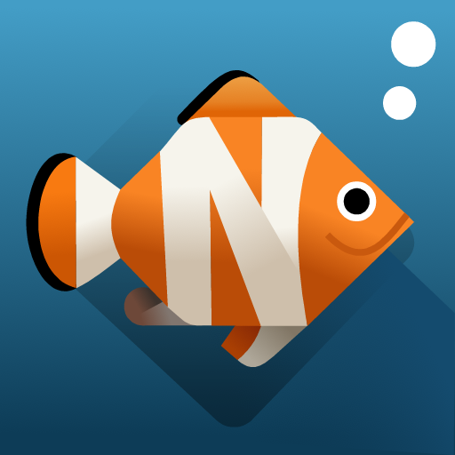
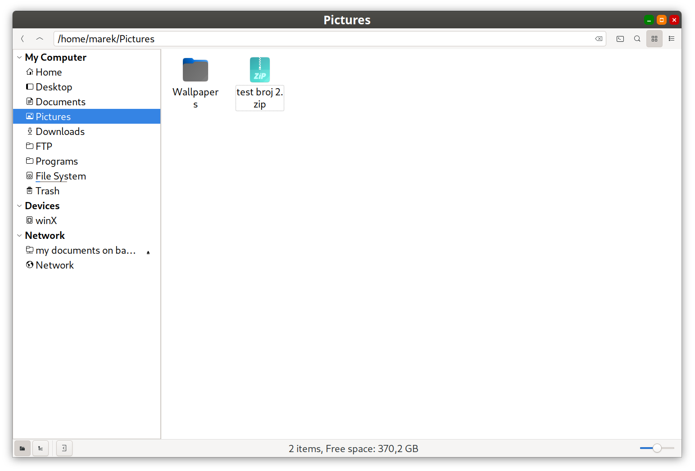
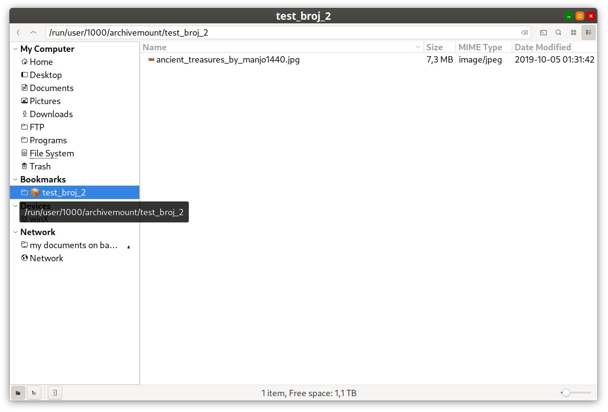

<h1>  Nemo Mount archive RW+ </h1>

Read-write archive mounting for the Nemo file manager, built on top of [`archivemount`](https://github.com/cybernoid/archivemount).

Right-click an archive (`.zip`, `.tar`, `.7z`, `.rar`, `.iso`, `.cpio`, ...) in Nemo, choose **"Mount archive RW+"**, and browse/edit its contents like a regular directory. When you unmount, `archivemount` writes the changes back into the archive.




> This is ment for convenience editing of existing archives. It's not a replacement for File-Roller or similar dedicated archivers. It can't create new archives, and offers none of the compression/format options a real archive manager gives you. For that, keep using File-Roller (or your distro's default archive manager).

## Read-only vs. RW+

Nemo ships with a built-in **"Mount Archive"** action that mounts archives through **read only ** GVfs.  
You can browse the contents, but you can't add, edit, rename, or delete anything inside.

This project installs a separate **"Mount archive RW+"** action, backed by `archivemount`, that mounts **read-write**.  
Every archive format `archivemount` (via `libarchive`) can read, **with one exception: RAR**. RAR archives can be read but not written back (libarchive has no RAR writer, since it's a proprietary format), so editing a mounted `.rar` will not persist on unmount.

To avoid the cofusion and actions competing for the same right-click menu entry, `install.sh` disables the built-in read-only one (see below).

## Features

- **RW mode** — mounts archives read-write via `archivemount -o rw`, so you can add, edit, rename, and delete files directly inside the archive (all formats `archivemount` supports, except RAR — see above).
- **Automatic GTK bookmark** — on mount, a bookmark is added to Nemo's sidebar (`~/.config/gtk-3.0/bookmarks`) pointing at the mounted archive, labeled with a 📦 icon; it's removed automatically on unmount.
- **Idempotent mounting** — re-running "Mount archive RW+" on an already-mounted archive just re-adds the bookmark and opens it, instead of mounting it twice.
- **Clean unmount action** — a matching "Unmount archive RW+" action appears when right-clicking the mounted directory, restricted to the tool's own mount points only.
- **No system package conflicts** — replaces Nemo's built-in (read-only, GVfs-based) "Mount Archive" action by disabling it, instead of fighting over the same menu entry.
- **Distro-agnostic installer** — one `install.sh` detects the package manager (`apt`, `dnf`, `pacman`, `zypper`) and installs everything needed.

## Scope

The tooling itself is **distribution-agnostic** — it targets Nemo on any Cinnamon (or Cinnamon-adjacent) desktop, using only standard XDG paths and each distro's own package manager. There's nothing Fedora- or Mint-specific baked into the scripts.

That said, **development and testing are done on Fedora 43**. Other distributions listed below should work identically in principle, and Linux Mint (Nemo's home distro) gets the most attention after Fedora, but they haven't been verified as thoroughly.

This is **not a replacement for File-Roller or a dedicated archive manager**. It's a convenience for working with the contents of an *existing* archive — mounting it and editing files in place, the way you'd work in a regular directory. It doesn't create new archives, doesn't offer compression settings, and doesn't handle multi-volume or split archives. For creating archives from scratch, or anything beyond quick in-place edits, use File-Roller (or your distro's preferred archive manager) instead.

## Requirements

- **archivemount** — does the actual FUSE-based read-write mounting.
- **gvfs** — provides archive mimetype/icon integration used by Nemo (and satisfies the `gvfsd-archive` dependency declared by the action).
- **nemo** — the file manager the actions are written for.
- **fuse / fusermount** — underlying kernel/userspace FUSE support (pulled in as a dependency of `archivemount`).

All of the above are installed automatically by `install.sh`.

## Installation

Clone or download this repo, then from inside the project directory:

```bash
chmod +x install.sh
./install.sh
```

The installer:

1. Installs dependencies (`archivemount`, `gvfs`, `nemo`) using whichever package manager it finds (`apt-get`, `dnf`, `pacman`, or `zypper`).
2. Copies `mount-archive.sh` to `~/.local/bin/mount-archive.sh`.
3. Installs `mount-archive.nemo_action` and `unmount-archive.nemo_action` into `~/.local/share/nemo/actions/` (per-user, no root needed, no hardcoded paths or usernames — the real script path is substituted at install time).
4. Disables Nemo's built-in "Mount Archive" action, if present, by renaming it to `mount-archive.nemo_action.off` under `/usr/share/nemo/actions/` (requires `sudo`).
5. Restarts Nemo (`nemo -q`) so the new actions show up immediately.

Re-running `install.sh` is safe — it won't create duplicate `.off` backups or duplicate bookmarks.

### Supported distributions

| Distro family                    | Package manager | Status                              |
|-----------------------------------|------------------|---------------------------------------|
| **Fedora 43**                      | `dnf`            | ✅ Development & testing platform     |
| Fedora (other versions), RHEL, CentOS | `dnf`         | ✅ Should work identically            |
| Linux Mint                         | `apt-get`        | ✅ Nemo's home distro, closely watched |
| Debian, Ubuntu, Pop!_OS             | `apt-get`        | ✅ Should work identically            |
| Arch, Manjaro, EndeavourOS          | `pacman`         | ✅ Should work identically            |
| openSUSE                            | `zypper`         | ✅ Should work identically            |
| Anything else                       | —                | ⚠️ manual install of the dependencies listed above |

Nemo actions and `archivemount` behave the same regardless of distro — the installer differences are purely about which package manager fetches the dependencies.

## Usage

- **Mount:** right-click an archive → **Mount archive RW+**. It's mounted under `/run/user/$UID/archivemount/<archive-name>/` and a bookmark appears in Nemo's sidebar.
- **Browse/edit:** open the bookmark, or the mounted folder, and work with the files normally.
- **Unmount:** right-click the mounted folder → **Unmount archive RW+**. The bookmark is removed, `archivemount` writes the archive back to disk, and the temporary mountpoint directory is cleaned up.

You can also drive it from a terminal:

```bash
mount-archive.sh /path/to/archive.zip     # mount
mount-archive.sh -u /run/user/1000/archivemount/archive   # unmount
```

## How it works

- `mount-archive.sh` sanitizes the archive's filename into a mountpoint name and mounts it under a per-user runtime directory (`/run/user/$UID/archivemount`), so mountpoints don't clutter the filesystem and are cleared automatically on reboot/logout.
- Bookmarks are managed by directly editing `~/.config/gtk-3.0/bookmarks`, matched and de-duplicated by `file://` URI.
- Unmounting only ever operates on paths under the tool's own mount root, so it can't be used to unmount arbitrary system mounts.

## Known limitations

- `archivemount` writes the whole archive back on unmount; large archives can take a while, and — per upstream's own disclaimer — a failure mid-write means potential data loss. A `.orig` backup of the previous archive contents may be created next to the archive during this process; see `archivemount`'s manpage for the `-o nobackup` option if you'd rather it not keep that copy.
- Only mimetypes listed in `mount-archive.nemo_action` (zip, tar, 7z, rar, iso, cpio, ...) trigger the menu entry.
- Requires a GTK3-based Nemo (the bookmarks file lives under `gtk-3.0`); this matches all current Nemo releases.

## Uninstalling

```bash
rm -f ~/.local/bin/mount-archive.sh
rm -f ~/.local/share/nemo/actions/mount-archive.nemo_action
rm -f ~/.local/share/nemo/actions/unmount-archive.nemo_action
sudo mv /usr/share/nemo/actions/mount-archive.nemo_action.off \
        /usr/share/nemo/actions/mount-archive.nemo_action   # restores Nemo's built-in action
nemo -q
```
